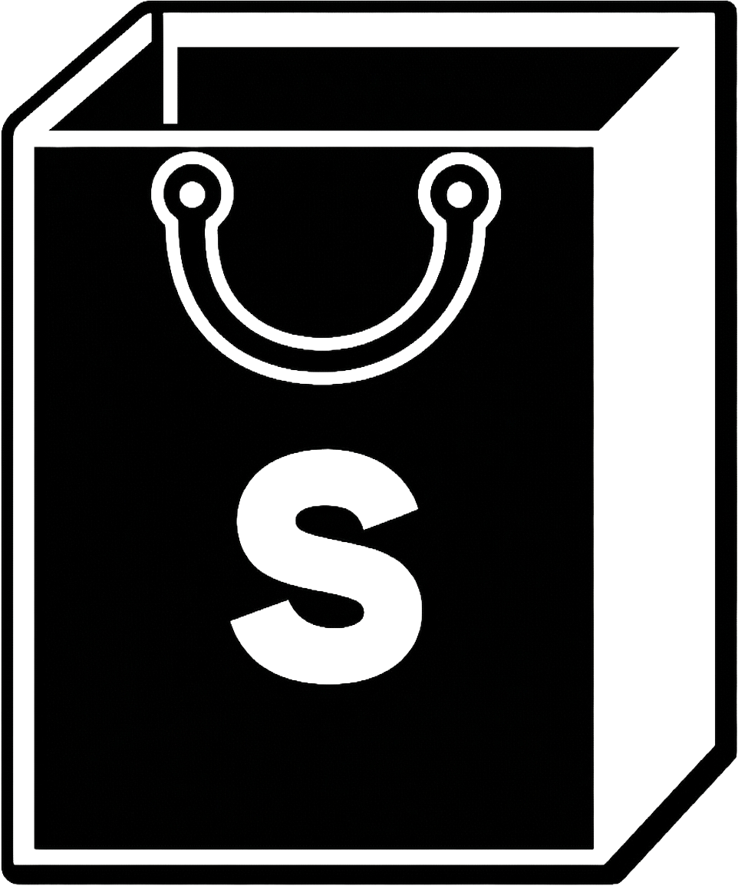

<p align="center">
  <picture>
    <source media="(prefers-color-scheme: dark)" srcset="./black-logo.png" />
    <source media="(prefers-color-scheme: light)" srcset="./white-logo.png" />
    
  </picture>
</p>

<h1 align="center">Salezo</h1>

<p align="center">
  The workspace for top-tier sales AI.
</p>

<p align="center">
  Salezo is a modern workspace for sales teams to manage projects, coordinate access, and build AI-assisted operations with a fast, focused interface.
</p>

<p align="center">
  <a href="#overview">Overview</a> •
  <a href="#features">Features</a> •
  <a href="#stack">Stack</a> •
  <a href="#getting-started">Getting Started</a> •
  <a href="#roadmap">Roadmap</a>
</p>

<p align="center">
  
  
  
  
  
</p>

## Overview

Salezo is designed as an operating system for high-performance sales teams. It brings together project structure, team access, collaboration flows, and the foundation for AI-powered tools in one streamlined product.

The current product direction focuses on clarity, speed, and operational control for sales reps, team leads, and owners.

## Features

- Project-based workspace for sales operations
- Join-by-key project access flow
- Role-aware team membership and approvals
- Bilingual interface with English and Russian support
- Light and dark themes with branded UI
- Supabase-backed authentication, database, and RLS policies

## Stack

- Next.js 16
- React 19
- TypeScript
- Tailwind CSS 4
- Supabase
- Framer Motion

## Getting Started

### 1. Install dependencies

```bash
npm install
```

### 2. Add environment variables

Create a `.env.local` file:

```bash
NEXT_PUBLIC_SUPABASE_URL=your_supabase_url
NEXT_PUBLIC_SUPABASE_ANON_KEY=your_supabase_anon_key
```

### 3. Start the development server

```bash
npm run dev
```

Open [http://localhost:3000](http://localhost:3000).

## Roadmap

- Expand project modules beyond the current workspace foundation
- Improve AI workflow tooling for sales teams
- Continue refining access control and collaboration flows
- Grow the public documentation over time

## Status

This repository is under active development. The README will expand gradually as the product and developer workflow mature.
